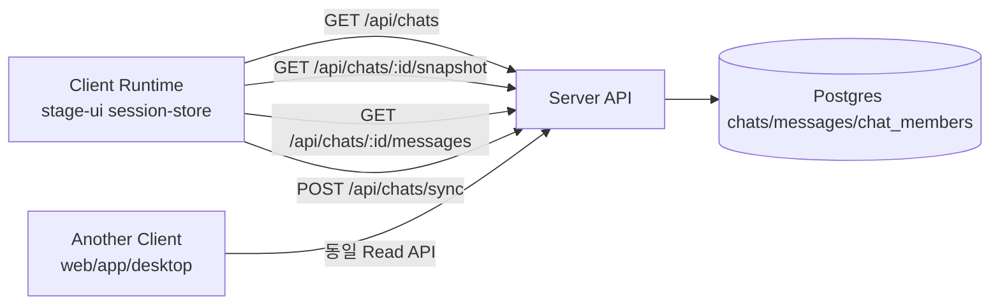
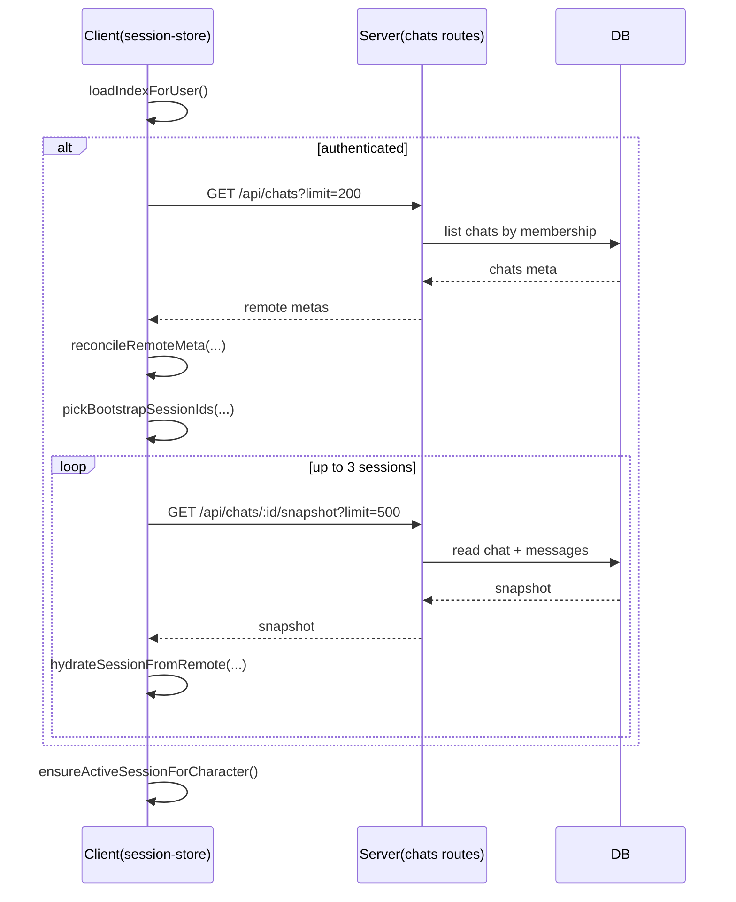
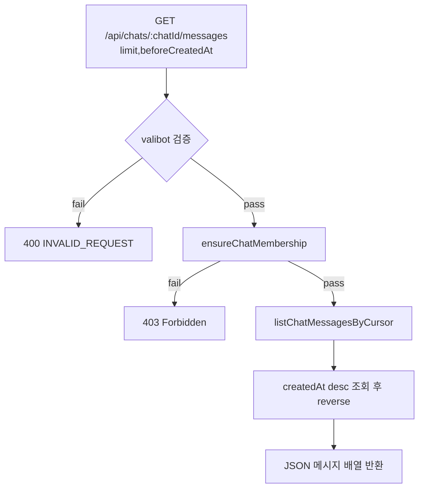

# Phase 1 구현 정리: 멀티클라이언트 채팅 연속성 (Read Path + Bootstrap)

이 문서는 현재 코드베이스에서 **Phase 1(세션 연속성 최소 완성)**으로 실제 구현된 항목을 정리한다.

> 목표: 기존 push-only(sync 업로드) 구조에 **pull/read 경로**를 추가해, 신규 디바이스 로그인 시 기존 대화를 이어받을 수 있도록 한다.

---

## 1. 문제 정의 (구현 전 상태)

기존에는 아래 흐름만 존재했다.

- 클라이언트 로컬 세션 저장
- `POST /api/chats/sync`로 서버 업로드

즉, **write path는 존재**했지만 아래가 부족했다.

- 서버 세션 목록 조회
- 서버 메시지 이력 페이징 조회
- 클라이언트 초기 부팅 시 원격 pull + hydrate

이 때문에 다른 디바이스에서 접속했을 때 자동 복원이 제한적이었다.

---

## 2. 이번 Phase 1에서 구현한 항목

### 2.1 서버 Read API 확장

추가/강화된 엔드포인트:

1. `GET /api/chats`
   - 내 채팅 세션 목록 메타 조회
   - `limit`, `beforeUpdatedAt` cursor 지원
2. `GET /api/chats/:chatId/snapshot`
   - 특정 세션의 메타 + 메시지 snapshot 조회
   - `limit`, `beforeCreatedAt` 지원
3. `GET /api/chats/:chatId/messages`
   - 특정 세션 메시지 cursor 기반 페이지네이션 조회
   - `limit`, `beforeCreatedAt` 지원

기존 유지:

- `POST /api/chats/sync`

### 2.2 입력 검증 강화 (Valibot)

Read API 쿼리는 모두 아래 정책을 적용한다.

- `limit`: 정수 + 최소/최대 범위 제한
- timestamp cursor: 음수 불가

즉, invalid query를 라우트 레벨에서 조기 차단한다.

### 2.3 서비스 레이어 분리

`chatService`에 아래 읽기 기능을 추가했다.

- `listChats(userId, options)`
- `getChatSnapshot(userId, chatId, options)`
- `listChatMessages(userId, chatId, options)`

내부에서는 재사용 가능한 helper를 둔다.

- `ensureChatMembership(...)`로 멤버십 검증
- `listChatMessagesByCursor(...)`로 cursor 페이징 공통화

### 2.4 클라이언트 Bootstrap Pull/Reconcile

`chat/session-store` 초기화 흐름에 원격 pull을 붙였다.

- 인증 사용자면 `pullRemoteSessions()` 실행
- 서버에서 세션 메타 pull
- 로컬과 메타 reconcile
- bootstrap 후보 세션들을 snapshot hydrate

추가로 단일 세션만 복원하지 않고, 아래 우선순위로 최대 3개 preload 한다.

1. 현재 active session (있으면)
2. 현재 캐릭터 매칭 세션
3. 최신 세션 fallback

이렇게 해서 신규 디바이스 진입 시 세션 점프/빈화면 체감을 줄인다.

---

## 3. 아키텍처 흐름 다이어그램

## 3.1 전체 통신 흐름

## 3.2 클라이언트 초기 부팅 시퀀스

## 3.3 메시지 페이징(read) 흐름

---

## 4. 데이터/정합성 정책 (Phase 1 범위)

- 권한: `chat_members`의 user membership 기반으로 read 허용
- 메시지 조회: `deletedAt is null`만 노출
- 정렬: DB에서 desc 후 reverse하여 응답은 시간 오름차순 유지
- snapshot/messages 모두 bounded limit 적용

---

## 5. 테스트 보강 내역

서버 단위 테스트에 아래 케이스를 추가했다.

- chats route:
  - 목록 조회 성공
  - snapshot 조회 성공
  - messages 페이지네이션 성공
  - invalid query(예: `limit=0`) 400
- chats service:
  - listChats membership 결과
  - getChatSnapshot membership 보호
  - listChatMessages cursor 페이징 순서

---

## 6. 현재 한계와 Phase 2로 넘기는 항목

Phase 1은 “읽기 경로 완성 + 초기 복원”에 초점을 맞춘다.

다음 단계(Phase 2) 후보:

- delta pull 주기화/백그라운드 sync 정책 고도화
- tombstone delete 흐름 정식화
- 다중 클라이언트 동시 수정 충돌 정책 세분화
- observability 지표(restore success rate, pull latency) 대시보드화

---

## 7. 구현 결과 한 줄 요약

이번 변경으로 채팅 시스템은

- **push-only** 에서
- **push + pull + bootstrap hydrate** 구조로 확장되었고,

신규 디바이스에서 동일 대화 세션을 이어받기 위한 최소 기능(Phase 1)을 충족하는 기반을 갖추게 되었다.
