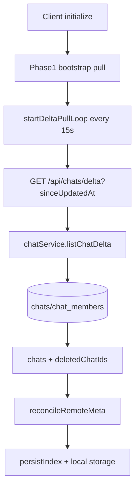
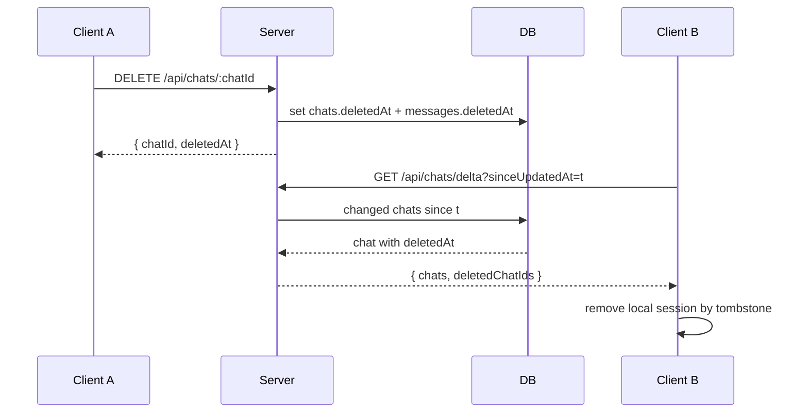
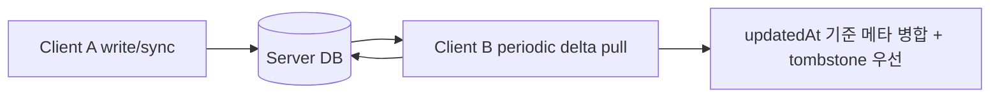

# Phase 2 구현 정리: 채팅 정합성 강화 (Delta Sync + Tombstone + 충돌 완화)

이 문서는 Phase 1 이후, 멀티클라이언트 환경에서 정합성을 높이기 위해 적용한 Phase 2 구현을 기능 관점에서 정리한다.

---

## 1) Phase 2 목표

Phase 2의 핵심은 아래 3가지다.

1. **Delta Sync**: 전체 재동기화가 아니라 변경분만 동기화
2. **Tombstone Delete**: hard delete 대신 삭제 마커 기반 전파
3. **동시성/재연결 내구성 강화**: 주기적 pull로 기기간 eventual consistency 개선

---

## 2) 서버 구현 사항

## 2.1 Delta 조회 API 추가

- `GET /api/chats/delta?sinceUpdatedAt=...&limit=...`
- 지정 시점 이후 변경된 chat 메타만 반환
- 반환 payload:
  - `chats`: upsert 대상으로 사용할 메타
  - `deletedChatIds`: tombstone으로 삭제된 채팅 id 목록

## 2.2 Tombstone 삭제 API 추가

- `DELETE /api/chats/:chatId`
- 수행 내용:
  - chats row: `deletedAt`, `updatedAt` 설정
  - messages row(해당 chat): `deletedAt`, `updatedAt` 설정
- hard delete를 피해서 다른 클라이언트가 delta pull로 삭제 사실을 복원 가능

## 2.3 서비스 레이어 정리

- `listChatDelta(userId, { sinceUpdatedAt, limit })`
- `softDeleteChat(userId, chatId)`
- 기존 snapshot/messages 조회와 멤버십 검증 정책은 유지

---

## 3) 클라이언트(stage-ui session-store) 구현 사항

## 3.1 원격 메타 tombstone 처리

`RemoteChatMeta`에 `deletedAt`을 추가해 서버 tombstone을 그대로 해석한다.

- `reconcileRemoteMeta`에서 `deletedAt`이 있으면:
  - local `sessionMetas/sessionMessages/sessionGenerations`에서 제거
  - index에서 세션 제거 및 active fallback 재선정
  - local storage 세션 레코드 삭제

## 3.2 주기적 Delta Pull 루프

인증 사용자 초기화 후 다음 동작 수행:

1. Phase 1 bootstrap pull 완료
2. `startDeltaPullLoop()` 실행
3. 주기(`15s`)마다 `GET /api/chats/delta` 호출
4. 변경 메타/삭제 마커를 로컬에 반영

## 3.3 세션 삭제 동기화

클라이언트 `deleteSession(sessionId)` 추가:

- 인증 상태면 서버 `DELETE /api/chats/:chatId` 호출
- 이후 로컬에 tombstone reconcile 적용
- 인덱스/스토리지 반영

---

## 4) Mermaid 다이어그램

## 4.1 Delta 동기화 루프

## 4.2 Tombstone 삭제 전파

## 4.3 동시 접속 시 충돌 완화(현재 단계)

---

## 5) 테스트 보강

Phase 2 관련으로 아래를 추가했다.

- route test:
  - `GET /delta` 변경분 조회
  - `DELETE /:chatId` 이후 delta에서 tombstone 관측
- service test:
  - `softDeleteChat` 이후 `listChatDelta`에 tombstone 포함 확인

---

## 6) 현재 범위와 후속

Phase 2에서는 “삭제 전파 + 변경분 pull + 주기 동기화”를 우선 반영했다.

추가 고도화 후보:

- 메시지 단위 delta 동기화 확장
- tombstone 보존기간/GC 정책
- 복수 디바이스 동시 수정 시 세분화된 충돌정책(필드 단위)
- delta loop 백오프/네트워크 상태 기반 adaptive interval
